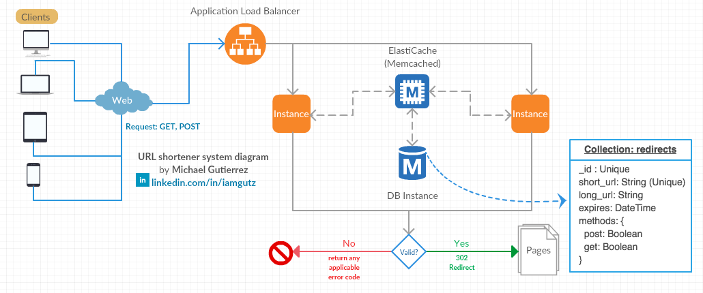

# Solution.md

The proposed solution is to build a micro-service to manage short url redirects, stored in a NoSQL database.

The micro-service will process the requests made by the clients (Multiplatform) and will redirect them to a long url.

Each record in the DB collection will contain the information for the micro-service to determine how to process the request, including the type of request methods that the url can process and if it's still active (not expired).

The system will have a load balancer in-front, to distribute the traffic and contain a setup of 2 instances of the micro-service.

The micro-service will first try to get the data for the request from the memcached instance, if the request is not found in memcached, it will query the DataBase to retrieve the information. If the data is found, it is returned to the micro-service, leaving the request and the result stored as persistent data in memcached for the next requests.

The query is based on the short url unique identifier. For example: http://trav.ix/yAlsd where 'yAlsd' is the unique identifier in the database collection. Also, it will filter the result by request method and if the date has not expired.

Separately, a CRUD system will need to be developed to manage the redirect records in the DB.

# Conclusion:
The advantage of this system is that it provides enough flexibility to manage URL redirects, keeping it simple using a relation of N:1, where N short-urls can redirect to 1 long-url without the need of complex redirect rules or regular expressions.
