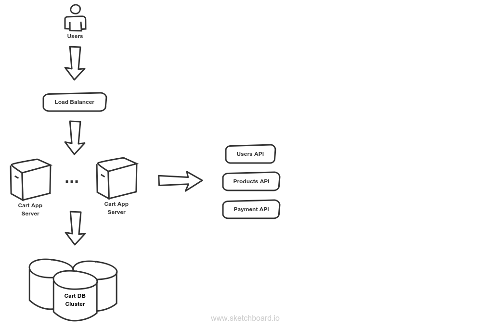
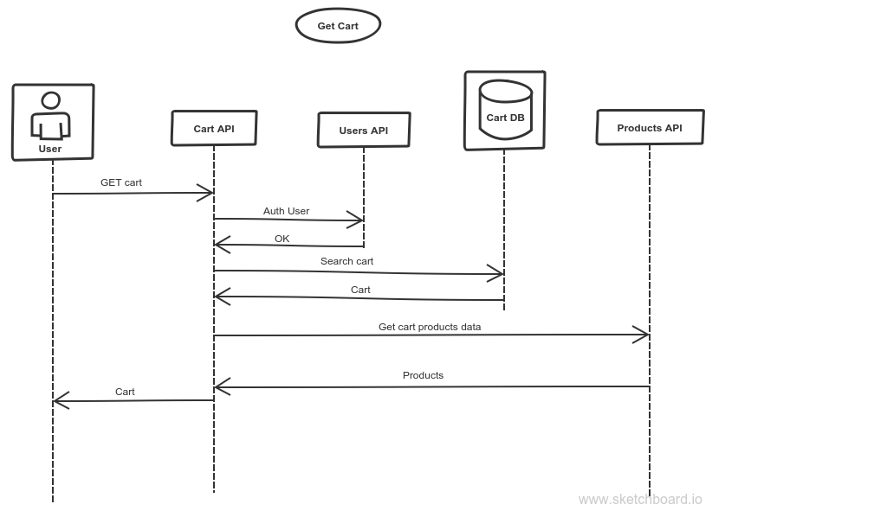

# Solution for Simple shopping cart system

Microservice made in Nodejs exposing a REST API in charge of making the requested actions.  
This cart app would interact with several other services for getting the product's data, user management, payments, etc. This way it would benefit from being a microservice and resolving just what it has to resolve, which is handling the cart.  
For persistance I'd use a Document database such as MongoDB, to store the entire cart as a document.  
The front end would be integrated in the same application used for the entire buying process. It will need to get cookies specific to cart app added, and probably use localstorage too. Web workers enhancing the user experience by adding offline capabilities would be a nice to have.  

## Cart Document Schema
*UserId* -> Identifier for the user. If not logged users should be supported, this id may get generated and saved in cookies for identifying anonymous users as well. Also probably include a flag to mark the document, as in the future we may want to clear old data from anonymous users.  
*CartId* -> Identifier for the cart itself. Since the user can save it, that would allow a user to have multiple carts (kind of wishlists maybe)  
*Products* -> Array containing the products added to the cart. The products would be objects, having:  
 - *ProductId*: Same as in the Products Service API.
 - *Quantity*: Number of items for the same product added.
 - *DateAdded*.
 - Any other useful information about the product that we may need.

*PaymentStatus* -> Possible options: 'Not Started', 'Started', 'Failed', 'Completed', etc. To know the progress of the buying process for the particular cart. Once everything is complete, it may get archived or moved somewhere else for storing historical data.  
*DateCreated*  
*DateModified* -> Useful information ;)  

## API Overview Details
Each request will include the UserId.  
Will support POST/PUT and DELETE for adding/deleting multiple items in the same request.  
GET for getting the cart for the user, and allow queries for specific data.  
POST to start checkout process.  
POST for saving the cart.  
(Haven't defined routes here to keep it simple.)  
  
## Sequence Diagrams

