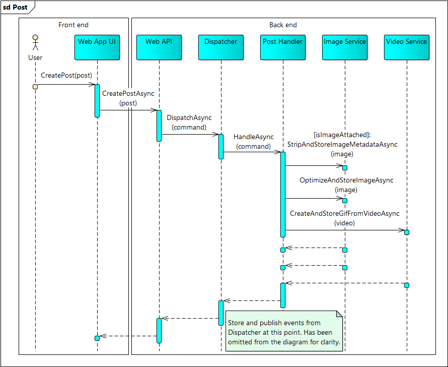

# Solution.md

The solution describes concepts of Trawiller moving from back end to front end.

As a general idea:

- Any major architectural decision is deferred as far as viable so that we have more information to make a better decision.
- The plan is to eventually make heavy use of Azure cloud services so early choices are affected by that.
- Technological and process choices are influenced by the experience of the development team.

## Data Storage

Conceptually, we are dealing with a mix of structured and less-structured data where the former lends itself more towards a relational and latter towards a graph model. The database technology does not need to be decided straight away. Due to plans to stick with Azure, we do constrain the choice to what is well supported on the cloud ([MSSQL](https://www.microsoft.com/en-us/sql-server/sql-server-2016), [Neo4j](https://neo4j.com/), [Graph Engine](https://www.graphengine.io/) to name a few). Initially, in-memory data providers are used to guarantee easy project setup and unit testing capabilities.

Benefits of using a relational model:
- Relational database management systems are widely used and have stood the test of time.
- Probably more developer experience in the team.

Benefits of using a graph model:
- More intuitive to visualize.
- Easier to design - no need for join/cross reference tables in case of many-to-many relations.
- No need for joins - potentially more performant.

Followers are a great example of a network of nodes in a graph model. When a post is made by a user, all the followers can easily be notified by just traversing related nodes of follower relation type of the user node. Also, posts are an example of data where a wide range of different type of entities could be attached to it and it could benefit from being less-structured.

Any user action is stored as an event. Application state at any given time is simply calculated from those events and snapshots of states are stored where performance is concerned. This makes it very easy to display a timeline in any time scale for a user of whichever actions are deemed necessary.

## Application Services

The idea is to start off with a simple monolith with well-defined domain boundaries and dependency directions between system components. The application suits well to a microservices based approach where video, image, audio, geolocation, authentication and other services could later be separated from the monolith to their corresponding self-contained services. A well-architected monolith allows to easily do that and the system isn't overcomplicated in its minimum viable product stage.

Authentication is realized through a third-party OAuth 2.0 provider (i.e. [AspNet.Security.OAuth.Providers](https://github.com/aspnet-contrib/AspNet.Security.OAuth.Providers)). This allows logging in with any major social media site.

Http protocol is used for most of the communication between a client and a server. Websockets protocol (with fallback options) is used for real-time data (i.e. notifications of new posts in the feed). TLS is applied for securing user data moving across the wire.

A concept of event dispatcher is used to perform actions in the system. For example, if a user creates a new post, the dispatcher sends the command to its corresponding handler which makes use of necessary services (see sequence diagram below). Once a command is handled, generated events are stored and published. A centralized dispatcher also allows easily applying middleware such as logging to the system.

A task scheduling mechanism (i.e. Task Scheduler in Windows or Scheduler service in Azure) is used to send daily reminders to the user.

## User Interface

For starters, the only client facing user interface will be a web application to keep development costs (both time and money) low. Dedicated mobile apps for Android and iOS platforms (possibly others as well) are planned for the next phase as they would provide additional functionality to make fulfilling requirements easier.

In order to post for the client even if Trawiller is not open, an HTML 5 geolocation API and a browser extension is used. In future, with native mobile apps, a simple background process can be setup.

## Development Standards & Process

The development team should agree on followed standards (i.e. SOLID) and code format. Editor code format rules are shared using [EditorConfig](http://editorconfig.org/) or [ReSharper](https://www.jetbrains.com/resharper/) shared settings.

Unit tests are strictly required and code coverage must be measured. Required coverage percentage needs to be decided and can be adjusted if needed. Coverage is measured based on statement coverage criteria. Whether unit tests are written following TDD guidelines or any other way is a matter of team's preference. Integration tests should prove that the application works together with external services. Performance tests are required to prove scalability.

Development process consists of sprints (duration TBD). In sprint meetings, tasks are selected to the sprint, time is estimated (Planning Poker?) and tasks assigned. Daily stand-ups (interval TBD), code reviews and retrospective meetings are to be held.

## Summary

- Start with in-memory data provider and move to relational and/or graph storage.
- Store the results of user-actions as events.
- Start with monolith and move gradually toward microservices.
- Start with a web application and later create native phone apps.
- Unit tests with overview of code coverage (based on statement coverage criteria).
- Integration and performance tests.
- Agile Scrum-like methodology.