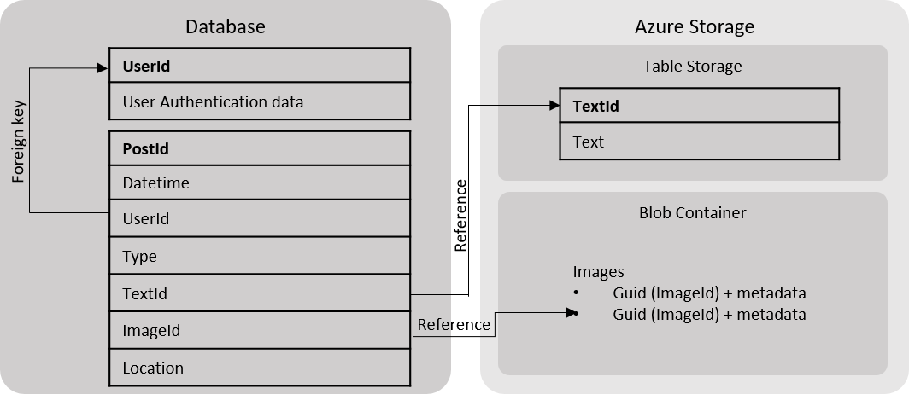

# Solution: Trawiller! - micro-blog platform

Trawiller! is split into two parts:
- **Backend API**: An azure hosted web app with that keep tracks of users and their posts
- **Frontend APP**: A frontend app on Android & iOS, the user's main interaction with Trawiller!

## Backend API

#### API
The following API should be available for the app:
- Authentication API
  - Login
  - Register
- Posts API
  - **Get posts**: (user id) return all posts for the current user
  - **Get post**: (post id) return infomation specific to the needed post
  - **Post data**: add a post for the current user

#### Data
The system should use a **traditional database** to store `user information` and a `list of all posts` without `post specific information`, the `post specific information` will be stored in **Azure storage**, recommended to store large blocks of text and images.

##### Database tables

**Users** this can include one or more tables depending on the chosen authentication framework (see [assumptions](assumptions.md)), there should be a unique User Id provided for each user.

**Posts** contains all posts for all users with the following columns:
- Post Id
- User Id
- DateTime
- PostType: Location only, images and text, image only, text only
- Location: (longitude and latitude) *can be empty*
- Text Id: (reference to the data in Azure storage Table)
- Image Id: (reference to the data in Azure storage Blob)

##### Azure storage

**Text Table**: contains the text for the user, columns:
- Text Id (clustered index)
- Text

**Image blob**: blob container containing all the images for the user, with the additional metadata added as metadata to the blob item

## Frontend APP

The responsibility of the frontend app include the following:
- Register and authenticate a user (using the authentication API)
- Allow the user to view his/her current timeline
- Allow the user to post
- Access the user's location and post to the app automatically when the location changes
- Remind the user to post if the user has not posted in the last 24 hours

The details of the application is out of scope.