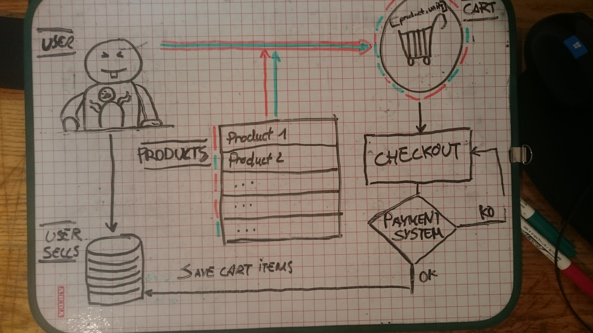

# Solution to shopping cart scenario

Several factory patterns will be dealing with those families of related products. Let's describe globally the entities/responsibilities from my solution.

**User** will have common user attributes (name, email, ...) and will save purchases(created_at, purchaseList).

**Product** will have common product attributes: `name, ref, price, ...` and `tax_rule`, `discount_rule` to identify which tax/discount applies. Prices, discounts and $$$ related stuffs are managed at a product level.

**Cart** maintaining a list `purchaseList` of tuple `[(Product, Units), ...]`. Also using localStorage to keep the card stored. Cart methods needs:
* `constructor` checking localStorage from previous sessions to update purchaseList in case exist.
* `add(Product, units)/delete(Product, units)` checking when to create/delete/increment/decrement.
* `getProduct(Product), getByOrder(), getBy...()` for queries on purchaseList.
* `applyOverallDiscount(percentage)`.
* `getCartPrice()`. Will loop throught `purchaseList` where ecah product has method to getPrice and apply taxes.

The interface of the cart allow change product units or remove the whole product, no matter the units.

**Checkout** entity will communicate with payment system and manage responses. In case OK will save purchaseList to the user. Otherwise send error notification.

## Diagram
(sorry for that)
